# TERRAFORM Tutorial for aws

# 수동으로 인스턴스 생성

## 1. Key Pair 생성
> 네트워크 및 보안 > 키페이

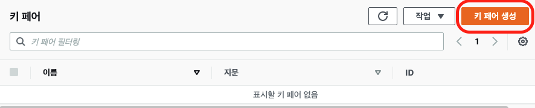
> openSSH 와 함께 사용을 선택하고 "키 페어 생성"을 클릭하면 key-sample.pem 이 자동으로 다운로드. 이 파일로 모든 인스턴스를 접근.

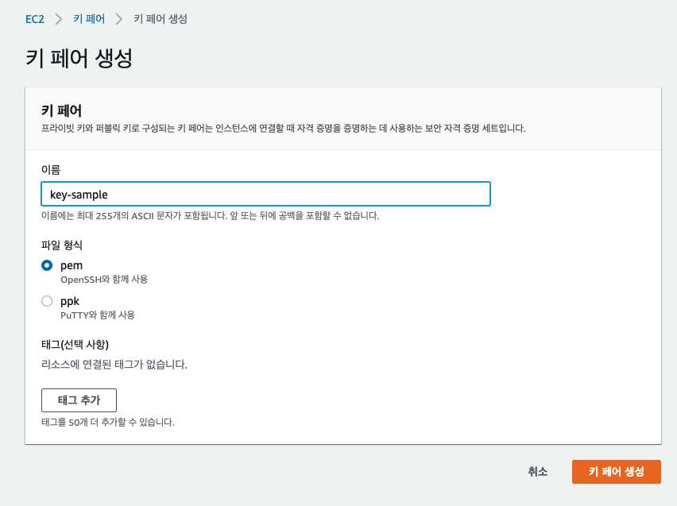


## 2. AWS bastion 인스턴스 생성
> 2.1 EC2 > 인스턴스 > 인스턴스 시작

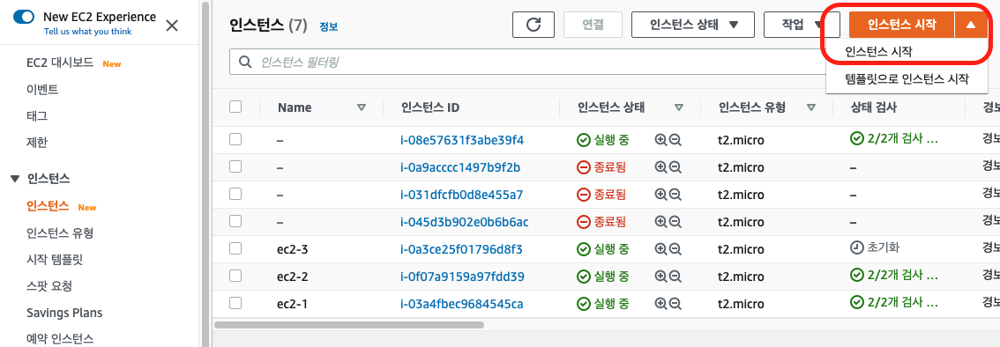

> 2.2 1단계 AMI 선택

Ubuntu Server 20.0.4 LTS 버전 선택
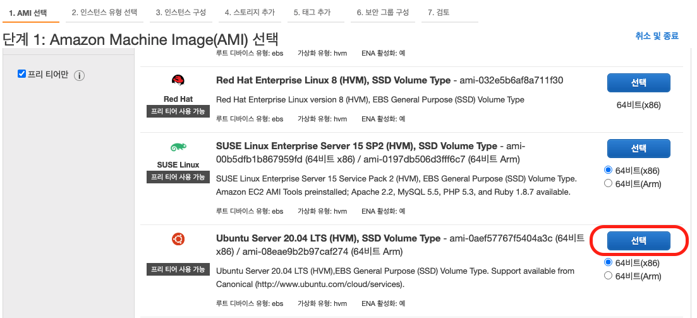

> 2.3 2단계 인스턴스 유형 선택

t2.micro 선택 > 다음
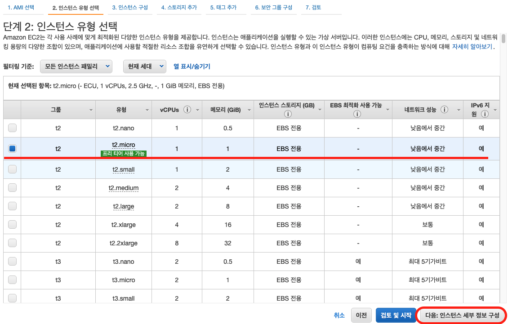

> 2.4 3단계 인스턴스 구성

네트워크 : 기본값 , 서브넷 : 기본값 , 퍼블릭 IP 자동 할당 : 활성화 > 다음
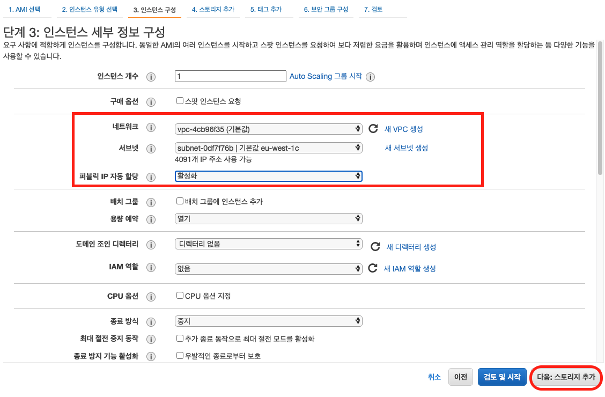

> 2.5 4단계 스토리지 추가

스토리치 추가 : 기본값 > 다음
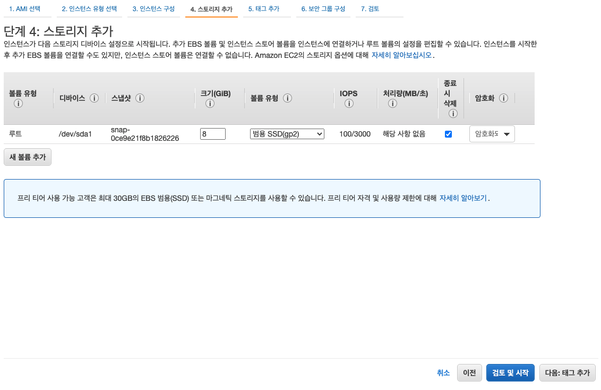

> 2.6 5단계 태그 추가

태그 : Name -> bastion_<사용자아이디> > 다음


> 2.7 6단계 보안 그룹 구성

SSH 만 허용 > 다음
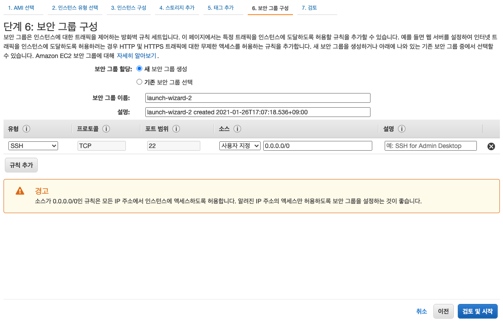

> 2.8 7단계 검토

시작하기
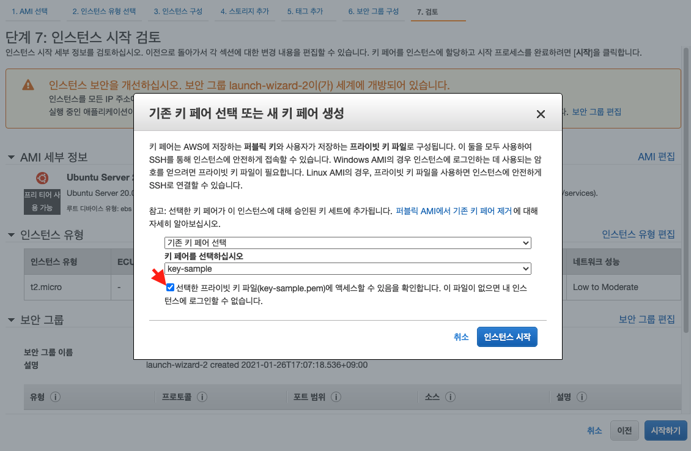


> 2.9 Bastion 서버로 접속하기

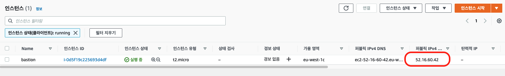
```
chmod 600 key-sample.pem
ssh -i key-sample.pem ubuntu@52.16.60.42
```

# Terraform 으로 ec2 자동 생성하기

# AWS Credential
> 내 보안 자격 증명 (Identity and Access Management(IAM) > CLI, SDK 및 API 액세스를 위한 액세스 키
```
export AWS_ACCESS_KEY_ID=xxxx
export AWS_SECRET_ACCESS_KEY=xxx
```

# Terraform Download
> https://www.terraform.io/downloads.html
```
$ sudo apt -y update
$ sudo apt install wget unzip git

$ wget https://releases.hashicorp.com/terraform/0.14.5/terraform_0.14.5_linux_amd64.zip
$ unzip terraform_0.14.5_linux_amd64.zip
$ sudo mv terraform /usr/local/bin

$ terraform --version
Terraform v0.14.5
```


# Usage
To run this example you need to execute:
```
$ git clone https://github.com/nationminu/terraform-tutorial-aws.git
$ cd terraform-tutorial-aws
```

> 다운로드 받은 키를 bastion 서버에 tutorial 디렉토리에 업로드.
```
$ ssh -i Downloads/key-sample.pem ubuntu@52.16.60.42 "mkdir -p /home/ubuntu/terraform-tutorial-aws/ssh"
$ scp -i key-sample.pem key-sample.pem ubuntu@52.16.60.42:/home/ubuntu/terraform-tutorial-aws/ssh/k
ey.pem
```


> main.tf <br>
> ec2 -> 고유한 이름으로 변경<br>
> key_name -> 다운로드 받은 키의 이름 <br>
> private_key -> 개인키가 있는 위치 지정
```
locals {
    vm_prefix = "ec2" #CHANGEME
    user_data = <<EOF
    #!/bin/bash
    echo "Hello Terraform!"
    EOF 
}

resource "aws_instance" "ec2" { 
    count                   = 3
    ami                     = "ami-0aef57767f5404a3c"
    instance_type           = "t2.micro"
    key_name                = "key-sample" 
    vpc_security_group_ids  = ["sg-ff04ffa7"] 
    subnet_id               = "subnet-473c2f0f"
    associate_public_ip_address = true
 
    credit_specification {
        cpu_credits = "unlimited"
    }

    tags = {
        Name = "${local.vm_prefix}-${count.index+1}"
        Terraform   = "true"
        Environment = "dev"
        Organization = "semyeong" 
    }   
 
    provisioner "local-exec" {
        command = "echo ${local.vm_prefix}-${count.index} ansible_host=${self.private_ip} ip=${self.public_ip} >> inventory.txt"
    }

    connection {
        user = "ubuntu"
        host = self.public_ip
        private_key = file(pathexpand("~/.ssh/id_rsa"))
        agent = "false"
        timeout = "5m"
    }
    
    provisioner "remote-exec" {
        inline = [
            "sudo apt -y update" 
        ]
    }
}
```

> init : 초기화 <br>
> plan : 실행전 테스트 <br>
> apply : 실행< br>
> plan -destroy  : 삭제 테스트 <br>
> destroy  : 삭제
```
$ terraform init

$ terraform plan

$ terraform apply 

$ terraform plan -destroy 

$ terraform destroy 
```

> terraform apply 실행후 프롬프트가 나타나면 "yes" 클릭 

```
$ terraform apply

... 

Do you want to perform these actions?
  Terraform will perform the actions described above.
  Only 'yes' will be accepted to approve.

  Enter a value: [yes]

Apply complete! Resources: 3 added, 0 changed, 0 destroyed.

Outputs:

id = [
  "i-0f6cec5c1ec7c281b",
  "i-03e26793b54ae198f",
  "i-0ca8570c4bbfa7a62",
]
private_ips = [
  "172.31.23.141",
  "172.31.19.49",
  "172.31.30.143",
]
public_ips = [
  "3.248.219.166",
  "52.50.89.21",
  "34.250.170.119",
]
```

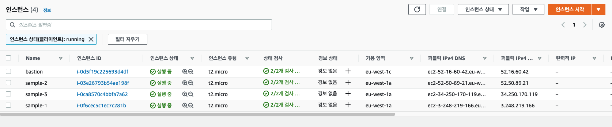

> 각 인스턴스에 정상적으로 접속되는지 확인한다.

# Multiple EC2 instance

> https://github.com/nationminu/terraform-tutorial-aws/tree/master/cluster/


# Referer
> https://registry.terraform.io/modules/terraform-aws-modules
> https://github.com/terraform-aws-modules
